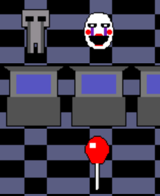
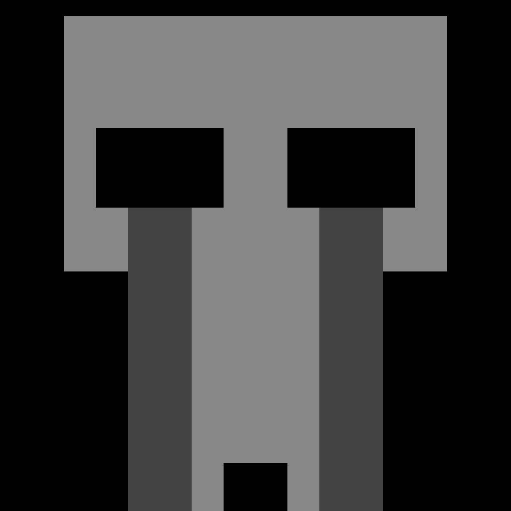

# so_long
**Subject by 42*

## This is the first graphical project. It introduces the graphical library of 42 : the `minilibx`.

A simple 2D video game, with collectibles, enemies and an exit door.

"*Help this **sad child's spirit** to <ins>collect</ins> his **birthday balloons** from this abandoned pizzeria, then go see the **puppet** so he <ins>can rest in peace</ins>.
Be careful not to cross paths with the **purple guy** at the risk of <ins>ending up in oblivion forever</ins>.*"



### How to test the program 👾

**First, open a `terminal` and clone the repositorie** :
```
git clone git@github.com:Nimpoo/so_long.git
```

**Second, download the `minilibx`** :
```
make minilibix
```

**Then you can run this to compile :**
```
make && ./cub3D maps/map.ber
```

### Commands
You can control the **crying child** with `WASD keys` and quit the game with `ESC`.

---

You can remove binary and compiled files :
```
make fclean
```
If you want, you can clean the directory by removing the minilibx :
```
make fclean_mlx
```

# ENJOY 🎈

